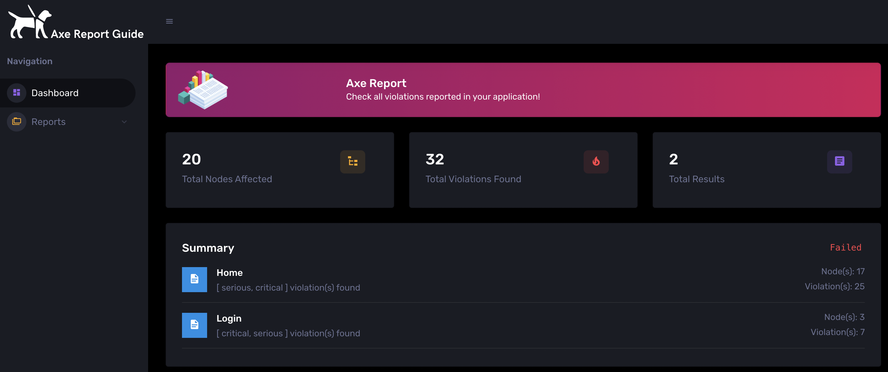
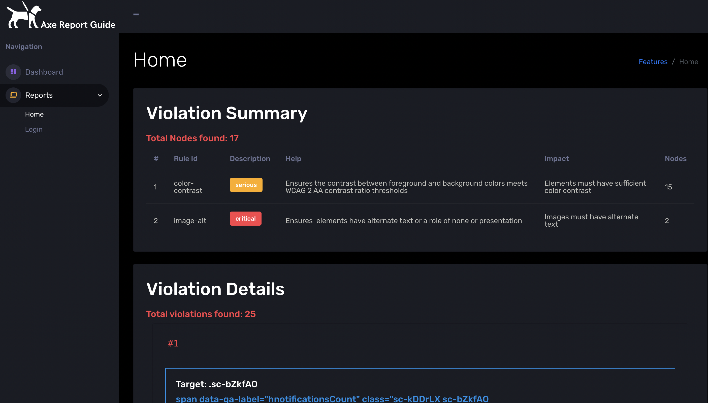

[](https://github.com/araujosnathan/axe-report-guide/actions/workflows/tests.yml)


Axe-Report-Guide is a report for Axe Result Violations for Accessibility Test.

# How to generate my report?

**Axe-Report-Guide**'s installation for git:

```
git clone https://github.com/araujosnathan/axe-report-guide.git
```

# What is need for running it?

You need to have `node` installed in your machine. <br>
And you will need to have `nvm` installed for managing versions of node. <br>
After these installations, you can execute command below for installing all dependencies.

```
nvm install 15 (You should use a version equal or above 15)
nvm use 15
npm install (This command installs all dependecies of the project)
```

# Command to create a report

All result files should be in a specific folder, you will need to passing the path for this folder as parameter. You can have one ou many result file.
<b>Note:</b> The result files should be identified for a final tag in json file. Like this: myReesult_file`.axe_result.json`

The JSON should have the Axe.Result[] object, see an exemple in `srs/test/resources/a11yResult.json`. It was generate from a Axe Configuration Reporter V2.

```
node app.js -r=../path/results -o=path/output
```

In the output path will be generated an `axe-report` folder with the dashboard for the result files like this:

Main Dasboard with general metrics:


Violations details of each result file:



<b>Remember:</b> This Initial project was created for attend my problem to report for the team about the results of accessibility test, but I understaned that can help other people. Feel free to send suggestions.

<b>Note:</b> This template uses a Corona Free Dark Bootstrap components.
